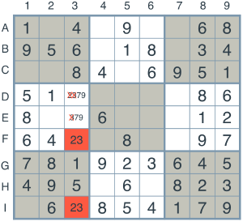

# Artificial Intelligence Nanodegree

## AIND-Soduku
In this project, you will be writing code to implement two extensions of our sudoku solver. The first one will be to implement the technique called "naked twins". The second one will be to modify our existing code to solve a diagonal sudoku. To complete this project you will use the tools you learned about in the lesson, and build upon them.

## Introductory Project: Diagonal Sudoku Solver

Constraint propagation is in simple terms a method that makes a given problem simpler to solve. it is a way of applying constraint methods multiple times until a solution or conclusion is obtained.

## Question 1 (Naked Twins)
Q: How do we use constraint propagation to solve the naked twins problem?  
A:  The Naked Twins technique is a way of using constrait propagation to exclude possibilites in a group.  In this case we identify a pair of twins within the same set of peers that have the same 2 numbers as possibilites.  The twin squares are typically visibile and hence the term 'naked twins'.  Because these two twins have no other possibilites we can deduce that 1 square must have 1 of the numbers and the other square the other number, hence a means of contraint propagation in order to reduce possible values.

  

## Question 2 (Diagonal Sudoku)
Q: How do we use constraint propagation to solve the diagonal sudoku problem?  

  

 
A: In this case we need to add 2 additional units, the first unit is [A1,B2,C3,D4,E5,F6,G7,H8,I9] and the second additional unit is [I1,H2,G3,F4,E5,D6,C7,B8,A9].  The requirements for the diagonal units are the same as the ones for the other units ie the digits 1-9 can only appear once. In this case a number of constraint techniques have been used in the code such as 'elimination' where we eliminate possible values for a box by looking at its peers; 'only-choice' where if there is only 1 box in a unit that will allow a certain digit, then that box must be assigned to that digit and 'naked-twins'.

  

 
